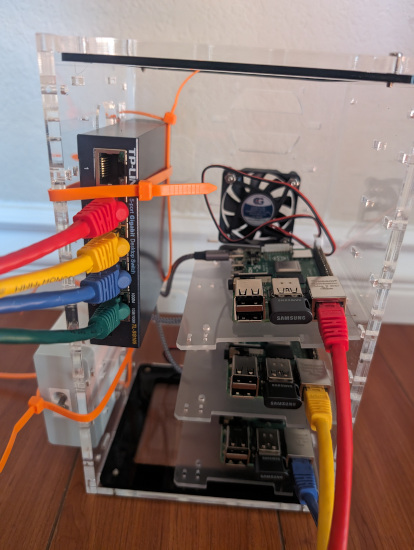

Title: Getting more familiar with Kubernetes (and the Raspberry Pis to prove it) Part 1
Date: 2023-11-15
Category: projects
Status: published
Tags: projects, kubernetes, hardware, linux
Slug: kubernetes-rpi-pt-1
Description: I made a Kubernetes cluster with a few Raspberry Pis. Was it worth it?
Summary: I made a Kubernetes cluster with a few Raspberry Pis. Was it worth it?

I started this project over a year ago on a whim. At `$DAY_JOB` I had to interact with Kubernetes,
but there were times when I felt uneasy doing _anything_ with it.

> ME: So just run: `kubectl apply -f maybe-a-scary-production-deployment.yml` to update the staging
> server?
>
> THEM: Yeah, after that you're good to go.
>
> ME: But it says production in the filename.
>
> THEM: Yeah, it's fine. You should have some settings that point you to the staging cluster. It's
> fine.
>
> ME: Hmmm.

I've spent over 10 years working across the stack in terms of building
sites/applications/infrastructure, but when it came to Kubernetes, it always felt like a mystical
force that granted you _Zero-Downtime_. It was time for that to change.

## The beginning

I tried [Kubernetes tutorials](https://kubernetes.io/docs/tutorials/), official and otherwise. The
terms make sense. I just needed more practical usage. I was also experimenting with (micro) services
architecture, so my eyes opened wide when I saw this Udemy course on
sale: [Microservices with Node JS and React](https://www.udemy.com/share/102VKE3@NvvIV6zas3ZRCkOZ-CK1CvlzrQbw3VaIn_MMF81SNtGH5RrXe8g4Lhcs2yt1e3x2qw==/).
I purchased the course (July 2022) when it was $20, and at the time of writing, it's now at a
whopping $130. For the amount of content the course has, it's definitely worth $20 -- unsure if I'd
pay $130 if you already have general full stack knowledge of web applications.

After going through bits of the course, I quickly found out that running Kubernetes locally is kind
of annoying and took up lots of resources. I didn't want to deal with creating and managing an
AWS/GCP/etc. account, but surely I can build my own without having to build a $1,000+ server.

Thankfully, I ran into this YouTube video (the YouTube algorithm knows too
much): "[i built a Raspberry Pi SUPER COMPUTER!!](https://www.youtube.com/watch?v=X9fSMGkjtug)".
Very useful video (IMO) for getting started, but apologies in advance if this type of content is
not for you. If you'd prefer not to watch the video and are familiar with YAML, skip ahead. I'll
also put a link at the end for a GitHub repository that contains setup information for your
Raspberry Pi nodes.

Generally, the video above goes through setup from start-to-cluster-ready. The rest of this will
focus on my personal experience with whatever tweaks/optimizations I made along the way.

## Hardware assembly

I've managed to keep spares of lots of things, especially cables. When the time comes to use the
things I've been stashing for years, I get excited -- then disappointed because it probably wasn't
worth lugging around 3+ moves "just in case" I need it. True that I used a few spare things in
storage, but the majority of the cost was still the Pis and case. Anyway, parts list below:

* Netgear unmanaged switch
* 4x Raspberry Pi 4
* CAT6 cables
* [3x SAMSUNG FIT Plus 3.1 USB Flash Drive](https://www.amazon.com/gp/product/B07D7PDLXC/)
* [C4Labs Cluster Case for Raspberry Pi](https://www.amazon.com/gp/product/B07D5MJ7PQ/)
* [3-pack short USB-C cables](https://www.amazon.com/gp/product/B0BBFP95GD)
* [Anker 60W 6-Port USB Wall Charger](https://www.amazon.com/gp/product/B00P933OJC)
    * NOTE: This is potentially not enough to power all 3 Pis at full load.

    
    <small>Final result with terrible cable management</small>

## Raspberry Pi setup

Once all that was assembled, time to get thing dang things up and running. Below are some general
instructions on what I did. The YouTube video above by NetworkChuck has a more detailed explanation
of how to do everything. I will also have a link to a GitHub repo containing these instructions and
some other helpful things I use to automate some minor tasks.

1. Use the
   official [Raspberry Pi Imager](https://www.raspberrypi.com/documentation/computers/getting-started.html#installing-the-operating-system),
   or your preferred method, to get an operating system on your USB drives.
2. Create and update some files on the USB drives _before_ inserting and running on your Pis:
    1. In the `[THE_USB_DRIVE]/boot` directory create an empty file with the filename `ssh`:
        * `touch [THE_USB_DRIVE]/boot/ssh`
    2. In `[THE_USB_DRIVE]/boot/config.txt` add a line containing `arm_64bit=1`:
        * `echo arm_64bit=1 >> [THE_USB_DRIVE]/boot/config.txt`
    3. (New to me) the official imager can now also set up SSH access. On the link above search
       for "Enable SSH".
3. At this point you can put the drives in, connect your network cables, and get them running
4. Find your Pis on your network. Easiest way is to check your router's settings.
5. (On each Pi) `ssh pi@[YOUR_PI_IP]`
    * NOTE: `pi` is the default username and `raspberry` is the default password.
6. Ensure every Pi is confirmed on the network and you now have the beginnings to a cluster!

## To be continued

This has been getting long-ish to write, so I'll take a break here and get back to the remainder on
the next post. If you don't see the GitHub link for the above yet, I'm working on it!
